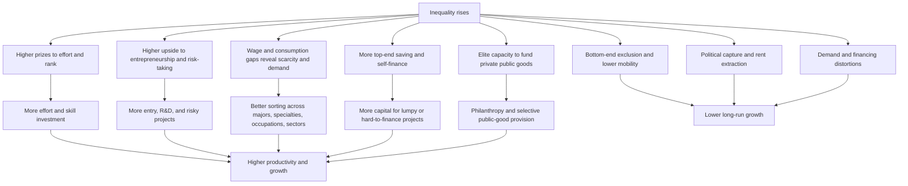

# The Bright Side of Economic Inequality

## Executive summary

The strongest pro-inequality arguments are **not** blanket claims that “more inequality is good.” They are narrower. They say that some **top-end, market-generated, and performance-linked dispersion** can improve incentives, sharpen labor-market signals, support entrepreneurial self-finance, and increase innovation or capital accumulation—especially over short and medium horizons, and especially when credit markets are imperfect. Classic foundations come from optimal-tax theory, tournament models, signaling and self-selection models, and Schumpeterian growth theory. citeturn46search0turn46search13turn46search2turn46search15turn37search4

The empirical literature is mixed but not empty. Panel evidence has found that higher inequality can be associated with **higher subsequent growth in the short to medium run**, with stronger positive effects in richer economies or when inequality is concentrated at the top rather than the bottom. More recent work also links innovation to higher top incomes while finding that **entrant-driven innovation** is positively associated with social mobility, which is the clearest modern empirical case that some inequality reflects productive rewards rather than pure rent extraction. citeturn45search0turn44search5turn43view0turn39view0turn20view0

The most credible positive channels are these: **effort incentives**, **entrepreneurship and risky investment**, **wage and consumption signals that guide sector and skill choices**, **higher saving and self-finance among the wealthy**, **capital pooling for large projects**, **sorting and specialization in hierarchical or superstar markets**, and **elite-funded public goods or philanthropy** in settings where the state is weak or slow. Evidence also shows that these channels are real but limited: the entrepreneurship/wealth channel is especially tail-specific, and elite-led public goods often come with strong bias toward elite preferences. citeturn33search3turn21view0turn22search3turn19search7turn19search8turn47search18turn30view1turn31view0

The main qualifier is crucial: the literature increasingly suggests a **horizon and composition split**. Channels that work quickly—effort, prize incentives, self-finance, demand-induced innovation, physical-capital accumulation—can look positive in panels. Channels that work slowly—bottom-end educational exclusion, reduced mobility, political capture, demand weakness, and financing distortions—often dominate in the long run. That is why short-run panels, richer-country panels, and top-tail measures often look more favorable to inequality than long-run or bottom-tail measures. citeturn39view0turn41view0turn43view0turn18view0

A balanced policy reading follows directly: **compress rents more than returns to innovation, effort, and scarce skill**; protect bottom-end opportunity so that inequality remains informative rather than exclusionary; and be skeptical of one-size-fits-all egalitarian policies that flatten signals, trigger avoidance, or chase mobile talent without raising much net revenue. At the same time, the broad empirical record does **not** justify treating high inequality as generally growth-enhancing. At best, some forms of inequality are instrumentally useful under particular institutional conditions. citeturn15search0turn15search1turn16search0turn41view0turn42search1

## Analytical lens

A useful way to organize the literature is by **type of inequality**, **mechanism**, and **time horizon**. The pro-inequality case is strongest for **top-end income or wealth dispersion tied to entrepreneurship, innovation, scarce talent, or delayed-risky investment**. It is weakest for inequality generated by monopoly power, capture, inheritance without competition, weak education finance, or barriers to entry. The distinction between **top-tail** and **bottom-tail** inequality is central in both theory and empirics. citeturn43view0turn20view0turn41view0turn31view0

The literature can also be read as a horizon split. Short-run mechanisms tend to be incentive and savings channels. Long-run mechanisms tend to run through human capital, mobility, and politics. That split helps reconcile why some influential panel studies find positive effects while longer-horizon or broader institutional studies find negative ones. citeturn45search0turn44search5turn39view0turn41view0

| Horizon | Mechanisms most likely to dominate | Stylized sign in the literature |
|---|---|---|
| Short to medium run | prize incentives, tournament effort, self-finance, rich-household saving, demand-induced innovation, physical-capital deepening | often positive or ambiguous |
| Long run | bottom-end underinvestment, weaker mobility, political capture, financing distortions for smaller firms, reduced inclusion | often negative unless institutions offset |

The causal map below is a synthesis of the main channels in the classic and modern literature. citeturn46search0turn46search13turn46search2turn46search15turn47search2turn26search11turn37search6turn39view0

## Effort, entrepreneurship, innovation, and risk-taking

The classic efficiency argument starts with incentives. In entity["people","J. A. Mirrlees","economist"]’s optimal-income-tax framework, redistribution is limited by incentive costs: if after-tax dispersion falls too much, labor supply and effort can fall as well. In parallel, entity["people","Edward P. Lazear","economist"] and entity["people","Sherwin Rosen","economist"] show that prize-like pay differences can implement efficient incentives through rank-order tournaments rather than direct piece rates. Later empirical work on corporate tournaments finds evidence broadly consistent with the theory: promotion prizes rise with the number of competitors, and pay rises strongly with hierarchical level, though the evidence is not uniformly supportive in all specifications. citeturn46search0turn46search13turn33search3

That logic extends naturally to entrepreneurship. When innovation is risky and returns are highly skewed, some ex post inequality can be the mechanism that compensates unsuccessful attempts and induces entry ex ante. Modern Schumpeterian work makes this explicit. entity["people","Philippe Aghion","economist"] and coauthors show that innovation is positively associated with top-income inequality across U.S. states, but also that innovation—especially **entrant innovation**—is positively associated with upward social mobility. Their interpretation is important: some top inequality is the by-product of creative destruction rather than simple rent extraction. citeturn20view0

Micro evidence points in the same direction. Finnish linked employer-inventor data show that invention creates sizable private gains inside firms, with inventors capturing only a minority of total private returns, while entrepreneurs and workers capture large shares as well. That means innovation-driven inequality at the top can coexist with broad within-firm spillovers rather than being purely zero-sum. citeturn38search8turn38search9

A related channel is tax-sensitive innovation and talent mobility. Evidence from the twentieth-century U.S. shows that personal and corporate taxes affect innovation, and international panel evidence shows that “superstar” inventors are responsive to top tax rates when choosing location. This does not imply that all top tax increases are self-defeating, but it does mean that compressing returns at the top can reduce the supply or location of some unusually productive innovative activity. citeturn15search6turn16search0turn16search1

Entrepreneurship under imperfect credit markets provides the cleanest theoretical case for wealth inequality. Models by entity["people","Marco Cagetti","economist"] and entity["people","Mariacristina De Nardi","economist"] show that tighter borrowing constraints reduce wealth concentration, **but also** reduce firm size, aggregate capital, and the share of entrepreneurs. The intuition is simple: when projects are lumpy, concentrated wealth relaxes financing frictions. But the best household evidence is more qualified. The wealth–entrepreneurship link is mostly flat through most of the distribution and rises sharply only at the very top, which suggests that this positive channel is real but quite tail-specific. citeturn19search7turn19search8

## Information, signaling, sorting, and mobility trade-offs

A different “bright side” has less to do with motivation and more to do with information. In entity["people","Michael Spence","economist"]’s signaling model, wage differentials help markets infer worker type when productivity is hard to observe directly. In entity["people","A. D. Roy","economist"]’s self-selection model, differences in expected returns help allocate people across occupations according to comparative advantage. The common point is that some dispersion is **informative**: it transmits scarcity, productivity, and fit. citeturn46search2turn46search6turn46search15

The most direct empirical support comes from education and specialty choice. In a major information experiment, students revised beliefs when shown true major-specific labor-market information; expected earnings and perceived ability significantly affected intended major choice, and the information intervention generated positive average welfare gains. Likewise, evidence on medical residents shows that specialty choices respond to expected earnings, hours, and training length. OECD cross-country data reinforce that high-skill occupational premia remain large: on average, specialists earn about 40 percent more than general practitioners across OECD countries and specialties, making those premia a meaningful part of career choice. citeturn21view0turn22search3turn13search1

This produces a real trade-off for egalitarian policy. If taxes, pay compression, or regulation flatten relative returns too aggressively, they may reduce not only inequality but also the informational content of wages. In fields with long training lags—medicine, engineering, research, advanced business services—that can slow the movement of talent toward scarce roles. The evidence is strongest for **choice responses** rather than for whole-economy welfare, so the allocative-efficiency argument is plausible but only moderately well identified. citeturn21view0turn22search3turn13search1

Sorting and specialization inside firms are another important channel. Rosen’s superstar model implies that small differences in talent can generate very large earnings differences when demand is scalable and better performers are poor substitutes for worse ones. Garicano and Rossi-Hansberg add a more organizational version: in knowledge hierarchies, firms use specialization and communication to leverage scarce expertise, and the result can be both **higher productivity** and **wider wage dispersion**. In this view, some inequality is not a pathology but the shadow price of hierarchical specialization in knowledge-intensive production. citeturn36search0turn34view0

A further nuance comes from recent wage compression. Post-pandemic U.S. wage compression reduced the college wage premium while increasing job-to-job movement among lower-wage workers. That is a reminder that flatter wage structures can improve some margins—bargaining power and reallocation for low-wage workers—even as they weaken some relative skill signals. The mobility trade-off is therefore real, but not one-directional. citeturn13search3turn13search15

## Capital accumulation, large projects, elite public goods, and dynamic growth

The oldest pro-inequality growth argument is basically a saving argument. In entity["people","Nicholas Kaldor","economist"]’s growth framework, higher-income groups save more, so an economy with more profit or top-income concentration can accumulate capital faster. Modern household evidence supports the factual premise: higher-lifetime-income households do save a larger fraction of income. That does not by itself prove that inequality is good for aggregate growth, but it does validate the classic mechanism. citeturn47search2turn47search18turn47search27

This channel matters most when projects are large, indivisible, or hard to collateralize. Financial-development models by entity["people","Jeremy Greenwood","economist"] and entity["people","Boyan Jovanovic","economist"] formalize a transition in which financial intermediation and growth reinforce each other. In such settings, inequality can rise during development because only some households can initially access or intermediate high-return opportunities; later, as finance deepens, the growth-inequality trade-off changes. Related development theory by Galor and Moav explicitly argues that inequality can support growth in early, physical-capital-driven stages but becomes harmful once human capital is the main engine. citeturn47search4turn37search6

The industry evidence fits this composition view. Recent work shows that more unequal income distributions are associated with faster growth in **physical-capital-intensive** industries and slower growth in **human-capital-intensive** industries. That is exactly the kind of mixed result one would expect if inequality raises saving and capital deepening but weakens broad human-capital accumulation. citeturn47search17

A related but less discussed mechanism runs through demand composition. In demand-induced innovation models, rich consumers are the first market for new or high-quality goods, so a thicker upper tail can increase innovators’ prices and expected profits. entity["people","Reto Foellmi","economist"] and entity["people","Josef Zweimüller","economist"] show that inequality can stimulate innovation through this price effect, even though it can also shrink mass-market size. Their baseline result is that the price effect can dominate. This is the cleanest formal version of the idea that **consumption differences convey demand** and help direct new products, new sectors, and eventually new skill investments. citeturn26search11

Dynamic growth evidence is correspondingly non-monotonic. entity["people","Kristin J. Forbes","economist"] finds a robust positive relationship between inequality and subsequent growth in the short to medium term in fixed-effects panel estimates. entity["people","Robert J. Barro","economist"] finds little overall effect, but a positive association in richer countries and a negative one in poorer countries. entity["people","Sarah Voitchovsky","economist"] shows that top-end and bottom-end inequality have opposite effects on growth, while entity["people","Daniel Halter","economist"] and coauthors show that inequality helps performance in the short run but lowers it in the long run. Put differently: some positive growth models are well supported, but the most credible empirical reading is **conditional and horizon-dependent**, not universal. citeturn45search0turn44search5turn43view0turn39view0

The political-economy case is narrower and more uncomfortable. Historical evidence from Qing China shows that local elites and the state could substitute for one another in public-good provision, with elites helping smooth grain-price volatility where state intervention was weaker. Experimental evidence shows that groups often coordinate on the public good preferred by the wealthiest member, while the wealthy voluntarily fund a disproportionate share of the cost. In modern practice, private philanthropic capacity is indeed highly concentrated: the top 10 percent of U.S. households who itemize are estimated to provide about 65 percent of individual charitable giving, and entity["organization","Gates Foundation","philanthropic foundation"] reports spending more than $100 billion in its first 25 years and expecting more than $200 billion of spending by 2045. The positive channel is real—large fortunes can finance real public goods—but so is the selection bias toward elite priorities. citeturn30view1turn31view0turn29search2turn29search3turn29search13

## Short-term harms, implementation risks, and why anti-inequality policy can backfire

Even on a “bright side” reading, the short-term harms are substantial. Rising top-income shares can weaken job creation at bank-dependent smaller firms because richer households shift savings away from deposits and toward market assets, raising relative financing costs for firms that rely on banks. At the same time, higher inequality can depress skills and educational attainment among people from poorer backgrounds, which is one reason long-run estimates often turn negative. citeturn18view0turn41view0

Poorly designed anti-inequality policy can also fail. High marginal tax rates can reduce real effort, but they can also induce avoidance, timing changes, and income shifting, so measured inequality may fall without much durable redistribution or revenue. The taxable-income literature makes that implementation risk central. Likewise, high tax rates on inventors or other mobile top earners can affect location decisions and innovation margins, especially for the most productive tail. citeturn15search1turn15search0turn16search0

Still, “backfire” is not the general rule. Both entity["organization","OECD","intergovernmental organisation"] and the entity["organization","International Monetary Fund","international financial institution"] find that redistribution, on average, need not undermine growth when it is well designed, and that lower inequality is associated with better long-run growth performance in much of the cross-country evidence. The key policy problem is therefore not whether to reduce inequality **at all**, but **which** inequality to compress and **how** to do it without destroying the useful signals and rewards tied to innovation, scarce skill, and entrepreneurial risk. citeturn41view0turn42search1

## Comparative table of key studies and theories

| Study or theory | Method | Main positive mechanism | Main finding | Main limitation | Sources |
|---|---|---|---|---|---|
| Incentive-compatible redistribution | entity["people","J. A. Mirrlees","economist"] (1971) | Optimal-tax theory | Some income dispersion is efficiency-preserving because redistribution weakens labor-supply and effort incentives at the margin. | Pure theory; does not identify empirically optimal inequality. | citeturn46search0 |
| Tournament incentives | entity["people","Edward P. Lazear","economist"] and entity["people","Sherwin Rosen","economist"]; later evidence by entity["people","Michael L. Bognanno","economist"] | Theory plus corporate evidence | Prize spreads can substitute for direct monitoring and raise effort; promotion prizes tend to rise with the number of competitors. | Can also create sabotage or weak cooperation; evidence is mixed across settings. | citeturn46search13turn33search3 |
| Signaling and self-selection | entity["people","Michael Spence","economist"] and entity["people","A. D. Roy","economist"] | Information economics | Wage and credential differentials can transmit information about productivity and comparative advantage, helping workers sort into better matches. | Hard to separate pure signaling from human-capital formation in practice. | citeturn46search2turn46search15 |
| Earnings information and field choice | entity["people","Matthew Wiswall","economist"] and Basit Zafar; Niccie McKay | Information experiment and specialty-choice estimation | Expected earnings materially affect major and specialty choices; information improves choices and welfare on average. | Tastes still dominate many choices; earnings are not the only margin. | citeturn21view0turn22search3turn13search1 |
| Superstar and knowledge-hierarchy models | entity["people","Sherwin Rosen","economist"]; entity["people","Luis Garicano","economist"] and Esteban Rossi-Hansberg | Theory | Small talent differences can produce large pay gaps in scalable markets; hierarchical specialization can raise both productivity and wage dispersion. | Mostly structural theory; socially optimal dispersion is not directly observed. | citeturn36search0turn34view0 |
| Rich saving more | entity["people","Nicholas Kaldor","economist"]; entity["people","Karen Dynan","economist"], Jonathan Skinner, Stephen Zeldes | Growth theory plus household data | If top earners save more, inequality can raise aggregate saving and support capital accumulation. | More saving need not translate into better broad-based growth if capital is misallocated. | citeturn47search2turn47search18turn47search27 |
| Entrepreneurship under borrowing constraints | entity["people","Marco Cagetti","economist"] and entity["people","Mariacristina De Nardi","economist"]; Erik Hurst and Annamaria Lusardi | Quantitative model plus micro evidence | Wealth concentration can relax self-financing constraints for entrepreneurs; tighter borrowing constraints reduce firm size, capital, and entrepreneurship. | Hurst-Lusardi show this is mostly a top-tail channel, not a broad one. | citeturn19search7turn19search8 |
| Finance, development, and stage-specific growth | entity["people","Jeremy Greenwood","economist"] and entity["people","Boyan Jovanovic","economist"]; Oded Galor and Omer Moav | Dynamic theory | Inequality can accompany growth when finance and physical capital are the bottleneck, but later becomes harmful when human capital matters more. | Strongly stage-dependent; not a general defense of inequality. | citeturn47search4turn37search6 |
| Demand-induced innovation | entity["people","Reto Foellmi","economist"] and entity["people","Josef Zweimüller","economist"] | Endogenous-growth theory with non-homothetic demand | Rich consumers can raise the price and profitability of new goods, increasing innovation incentives. | Depends on demand structure; market-size losses can offset price effects in some settings. | citeturn26search11 |
| Innovation and top inequality | entity["people","Philippe Aghion","economist"] and coauthors | State panels, IV, linked firm-worker data | Innovation raises top incomes, but entrant innovation is positively correlated with social mobility; invention rents spill to entrepreneurs and workers, not just inventors. | Patents are imperfect proxies; innovative inequality is not the same as all inequality. | citeturn20view0turn38search8turn38search9 |
| Growth regressions | entity["people","Kristin J. Forbes","economist"]; entity["people","Robert J. Barro","economist"]; entity["people","Sarah Voitchovsky","economist"]; entity["people","Daniel Halter","economist"] et al. | Cross-country and panel regressions | Short-run or richer-country effects can be positive; top-tail and bottom-tail inequality often have opposite signs; long-run net effects tend to be negative. | Sensitive to horizon, sample, and inequality measure. | citeturn45search0turn44search5turn43view0turn39view0 |
| Elite public goods and philanthropy | entity["people","Cong Liu","economist"] and Se Yan; entity["people","Luca Corazzini","economist"] et al. | Historical panel, experiment, institutional evidence | Elites can substitute for the state in providing selected public goods and often fund a disproportionate share of them. | Provision is biased toward elite preferences and is not democratically accountable. | citeturn30view1turn31view0turn29search2turn29search3 |

## Policy implications and limitations

The most defensible policy implication is **discrimination across types of inequality**. Policy should be relatively cautious about flattening returns to genuine innovation, scarce skill, entrepreneurship, and difficult-to-monitor effort, because these are the places where the positive evidence is strongest. By contrast, policy can be much more aggressive against inequality tied to monopoly power, inheritance-based lock-in, regulatory capture, political influence, or tax avoidance, because those forms add less allocative value and often undermine long-run growth. citeturn20view0turn31view0turn15search0turn15search1

A second implication is that **bottom-end opportunity is the hinge variable**. The empirical record becomes much less favorable to inequality when dispersion is driven by low-end underinvestment in skills and mobility. That means education finance, early-life investment, access to risky but productive career paths, and startup finance for people without family wealth are complements to any incentive-based defense of inequality. If those institutional supports are weak, the “bright side” collapses into exclusion. citeturn41view0turn43view0turn19search7turn21view0

A third implication is design. Anti-inequality policy is least likely to backfire when it uses **broad tax bases, strong enforcement, targeted transfers, competition policy, and equal-opportunity investments**, rather than blunt compression of all top-end returns. The best available cross-country policy work does not support a simple equality-efficiency trade-off, but it does support avoiding policies that mainly create avoidance margins or penalize highly mobile innovative talent. citeturn42search1turn41view0turn16search0turn15search0

The limits of the evidence are substantial. Much of the literature is reduced-form and sensitive to measurement: income inequality, top-income shares, wealth inequality, wage dispersion, and consumption inequality are not interchangeable. Time horizon matters a lot, as do institutions, financial depth, and whether inequality originates in innovation, rents, or transfers. The positive case is therefore strongest as a **conditional, mechanism-specific claim**, not as a general defense of high inequality. citeturn39view0turn43view0turn41view0